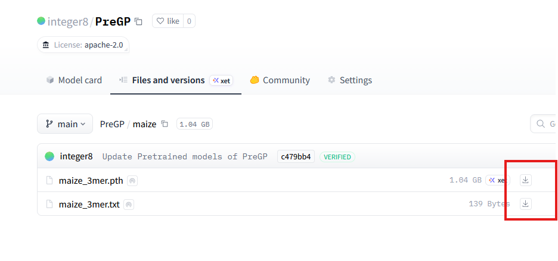

<div align="center">
  <h1>PreGP: A Crop Genomic Prediction Method based on a Pretraining-Finetuning Framework</h1>
  <p>
    
    
    
    
    
  </p>
</div>
PreGP is a crop genomic prediction method based on a pretraining-finetuning Framework. Through this tutorial, you can complete model pre-training and fine-tuning to achieve phenotype prediction. :four_leaf_clover:

## :green_book: Tutorial
### :hammer: Create Environment
1. Install Anaconda.

It is recommended to use Anaconda to build the model training environment.

2. Enter the PreGP directory.
```
cd PreGP
```
3. Execute the following command to create the PreGP environment
```
conda create -n PreGP -f pregp_env.yml
```
### :runner: Pretrain Phase
1. Activate the PreGP environment. 
```
conda activate PreGP
```
2. Start pretraining.
```
bash pretrain.sh
```
Here are the meanings of some key parameters, which need to be modified as needed.

| Parameter | Description |
|-----------|-------------|
| `geno_path` | Path to genotype data CSV file |
| `pretrain_model_path` | Directory to save pre-trained model checkpoints |
| `run_log_path` | Directory for training logs |
| `vocab_path` | Directory containing vocabulary files |
| `checkpoint_save_path` | Directory to save training checkpoints |
| `checkpoint_load_file_path` | Directory to load checkpoints from |

For more parameter descriptions, please refer to [`PARAMETER.md`](PARAMETER.md).
### :walking: Finetuning Phase
1. Activate the PreGP environment. 
```
conda activate PreGP
```
2. Start finetuning.
```
bash finetuning.sh
```
Here are the meanings of some key parameters, which need to be modified as needed.

| Parameter | Description |
|-----------|-------------|
| `load_model_name` | Filename of the pre-trained model checkpoint to load |
| `cvf_path` | Path to cross-validation folds CSV file |
| `phe_path` | Path to phenotype data CSV file |
| `pretrain_model_path` | Directory containing the pre-trained model |
| `fine_tuning_model_path` | Directory to save fine-tuned model checkpoints |
| `geno_path` | Path to genotype data CSV file |
| `run_log_path` | Directory for training logs |
| `vocab_path` | Directory containing vocabulary files |
| `vocab_name` | Name of the vocabulary file |
| `pred_save_path` | Directory to save prediction results |
| `unfreeze_from_layer` | Layer index from which to unfreeze parameters |

For more parameter descriptions, please refer to [`PARAMETER.md`](PARAMETER.md).

### :raising_hand: Download Pretrained Models and Vocabularies
You can download our pretrained models trained on large-scale genotype data and vocabularies at Hugging Face. Access [Hugging Face](https://huggingface.co/integer8/PreGP) :hugs: through the following link.
```
https://huggingface.co/integer8/PreGP
```
- Method 1: Directly download the model and vocabularies through the browser.

Simply click the download button next to the model to download the model weights and vocabularies you need.



- Method 2: Use git clone to get the models and vocabularies.
1. Install `git lfs`. If you are using `Ubuntu`, you can install it with the following command.
```
sudo apt update
sudo apt install git  
sudo apt install git-lfs  
git lfs install
```

2. Execute the following command.
```
git clone https://huggingface.co/integer8/PreGP
```
